# Fabiano Arthur — portfolio

**A fast, accessible, bilingual (English / Português) portfolio with light and dark themes — a fully static Next.js site deployed to GitHub Pages.**

[Português (Brasil)](README.pt-BR.md) · **Live site:** <https://fabianoarthur.github.io/portifolio/>

[](https://github.com/FabianoArthur/portifolio/actions/workflows/ci.yml)


<picture>
  <source media="(prefers-color-scheme: dark)" srcset="docs/assets/screenshot-dark.png">
  
</picture>

## What it is

My personal site: who I am, what I use and the open-source projects I've built —
multi-agent tooling for Claude Code, web apps with live demos, and APIs. Each project card
links to its repository and, where there is one, to its live demo.

Why it's worth a look as code:

- **Fully static, no server.** Next.js 16 (App Router) with `output: "export"`: both
  languages are prerendered at build time into plain HTML, CSS and JS.
- **Bilingual by design.** `next-intl` with one message catalogue per language; a test
  fails CI if a key, a placeholder or a project's copy is missing in either language.
  The root page picks English or Portuguese from the browser, with plain links as the no-JS fallback.
- **Light and dark, no flash.** A tiny inline script sets the theme before first paint
  (system preference, or the visitor's saved choice).
- **Accessible.** Semantic landmarks, a skip link, visible focus, labelled controls,
  `prefers-reduced-motion` respected, content never hidden when JavaScript fails.
  Lighthouse (measured locally on the production build): accessibility **100**, performance 95–100.
- **Secure by default.** A strict Content-Security-Policy (no third-party origins),
  injected before every resource and verified after each build; secret scanning in CI;
  actions pinned by SHA. See [SECURITY.md](SECURITY.md).

<p align="center">
  
</p>
<p align="center">
  
</p>

## How it works

<picture>
  <source media="(prefers-color-scheme: dark)" srcset="docs/assets/how-it-works-dark.svg">
  
</picture>

## Run it locally

Requirements: **Node 22** (see `.nvmrc`).

```bash
npm ci
npm run dev            # http://localhost:3000 (redirects to /en/ or /pt/)
```

Production build, exactly as deployed:

```bash
npm run build          # static export to out/ + CSP injection
npm run check:export   # verifies pages, lang, CSP placement, no local paths
npx serve out          # or any static file server
```

To reproduce the GitHub Pages sub-path locally: `PAGES_BASE_PATH=/portifolio npm run build`.
Environment variables are optional and documented in [`.env.example`](.env.example).

## Project layout

```
app/
  layout.tsx              pass-through root layout
  page.tsx                root: picks a language and redirects
  [locale]/layout.tsx     <html lang>, metadata, hreflang, theme script
  [locale]/page.tsx       the page: hero, projects, about, stack, contact
  not-found.tsx           bilingual 404
  opengraph-image.png/    social preview, rendered at build time
components/               server components + two small client ones (theme toggle, reveal)
lib/                      pure logic: locales, theme, paths, projects (+ unit tests)
messages/                 en.json, pt.json
scripts/                  CSP injection, export check, diagram generator
docs/assets/              screenshots and the animated diagram
```

To add or change a project: edit `lib/projects.ts` and its copy under
`projects.items` in both `messages/*.json`.

## Tests and quality gates

```bash
npm run lint
npm run typecheck
npm test               # Vitest: locale detection, redirect script, theme, paths,
                       # project data, message parity, CSP injection, export checks
```

CI runs all of the above plus the production build, `check:export` and a
[gitleaks](https://github.com/gitleaks/gitleaks) scan of the full history on every push and pull request.
Pushes to `main` deploy to GitHub Pages.

The diagram is generated: `node scripts/build-diagram.mjs`.

## License

[MIT](LICENSE) © 2026 Fabiano Arthur
