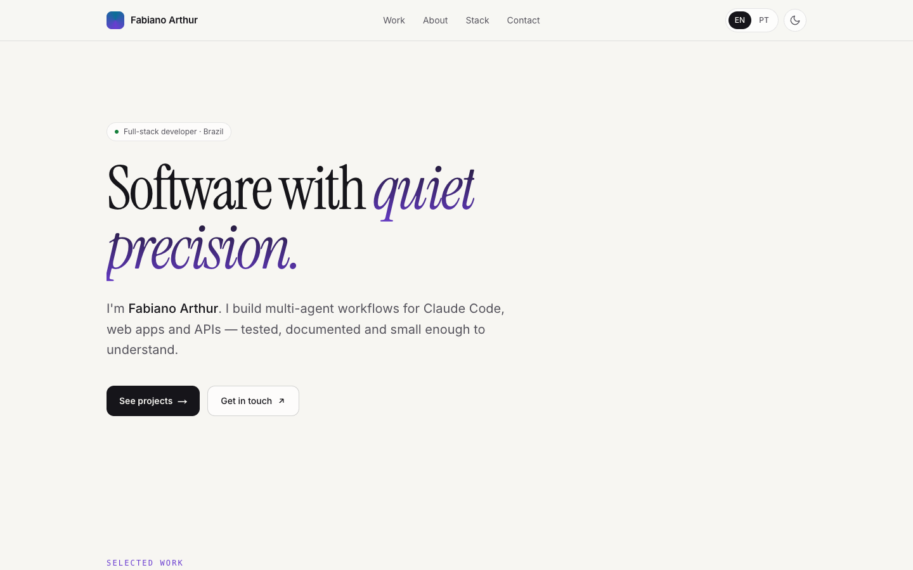
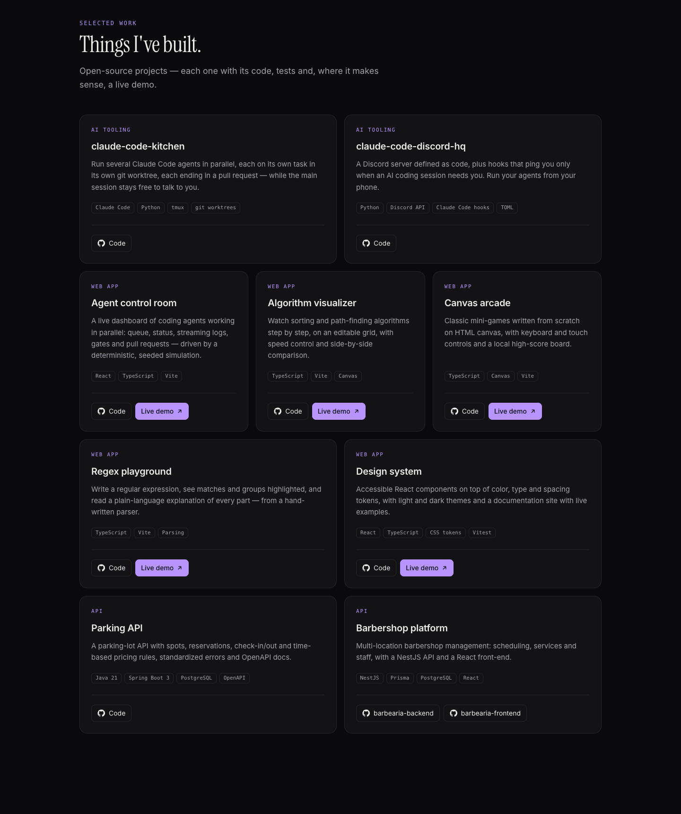
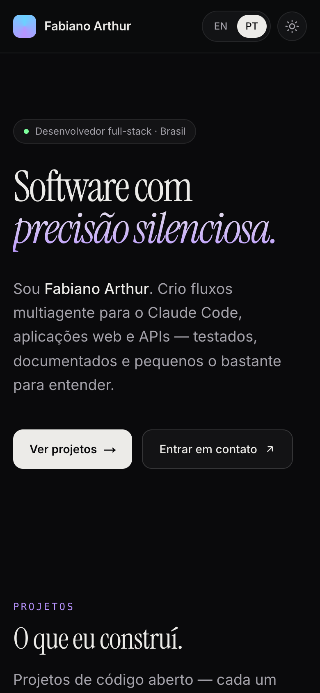

# Fabiano Arthur — portfólio

**Um portfólio rápido, acessível e bilíngue (inglês / português), com temas claro e escuro — um site Next.js totalmente estático publicado no GitHub Pages.**

[English](README.md) · **Site no ar:** <https://fabianoarthur.github.io/portfolio/pt/>

[](https://github.com/FabianoArthur/portfolio/actions/workflows/ci.yml)


<picture>
  <source media="(prefers-color-scheme: dark)" srcset="docs/assets/screenshot-dark.png">
  
</picture>

## O que é

Meu site pessoal: quem eu sou, o que eu uso e os projetos de código aberto que construí —
ferramentas multiagente para o Claude Code, aplicações web com demo no ar e APIs. Cada card
de projeto leva ao repositório e, quando existe, à demo.

Por que vale olhar o código:

- **Totalmente estático, sem servidor.** Next.js 16 (App Router) com `output: "export"`: os
  dois idiomas são pré-renderizados no build em HTML, CSS e JS puros.
- **Bilíngue de verdade.** `next-intl` com um catálogo de mensagens por idioma; um teste
  quebra o CI se faltar chave, placeholder ou texto de projeto em qualquer um dos dois.
  A página raiz escolhe inglês ou português pelo navegador, com links simples como fallback sem JS.
- **Claro e escuro, sem piscar.** Um script inline minúsculo aplica o tema antes da primeira
  pintura (preferência do sistema ou a escolha salva do visitante).
- **Acessível.** Landmarks semânticos, link para pular ao conteúdo, foco visível, controles
  rotulados, `prefers-reduced-motion` respeitado e conteúdo que nunca some se o JavaScript
  falhar. Lighthouse (medido localmente no build de produção): acessibilidade **100**, performance 95–100.
- **Seguro por padrão.** Content-Security-Policy estrita (nenhuma origem de terceiros),
  injetada antes de qualquer recurso e conferida a cada build; varredura de segredos no CI;
  actions fixadas por SHA. Veja o [SECURITY.md](SECURITY.md).

<p align="center">
  
</p>
<p align="center">
  
</p>

## Como funciona

<picture>
  <source media="(prefers-color-scheme: dark)" srcset="docs/assets/how-it-works.pt-BR-dark.svg">
  
</picture>

## Rodar localmente

Requisito: **Node 22** (veja `.nvmrc`).

```bash
npm ci
npm run dev            # http://localhost:3000 (redireciona para /en/ ou /pt/)
```

Build de produção, igual ao publicado:

```bash
npm run build          # export estático em out/ + injeção da CSP
npm run check:export   # confere páginas, lang, posição da CSP e ausência de caminhos locais
npx serve out          # ou qualquer servidor de arquivos estáticos
```

Para reproduzir o subcaminho do GitHub Pages: `PAGES_BASE_PATH=/portfolio npm run build`.
As variáveis de ambiente são opcionais e estão documentadas no [`.env.example`](.env.example).

## Estrutura

```
app/
  layout.tsx              layout raiz que só repassa
  page.tsx                raiz: escolhe o idioma e redireciona
  [locale]/layout.tsx     <html lang>, metadados, hreflang, script de tema
  [locale]/page.tsx       a página: hero, projetos, sobre, stack, contato
  not-found.tsx           404 bilíngue
  opengraph-image.png/    prévia para redes sociais, gerada no build
components/               server components + dois client pequenos (tema, revelação)
lib/                      lógica pura: idiomas, tema, caminhos, projetos (+ testes)
messages/                 en.json, pt.json
scripts/                  injeção da CSP, checagem do export, gerador do diagrama
docs/assets/              prints e o diagrama animado
```

Para incluir ou mudar um projeto: edite `lib/projects.ts` e o texto em `projects.items`
nos dois `messages/*.json`.

## Testes e gates de qualidade

```bash
npm run lint
npm run typecheck
npm test               # Vitest: detecção de idioma, script de redirecionamento, tema,
                       # caminhos, dados dos projetos, paridade das mensagens, CSP, checagem do export
```

O CI roda tudo isso, mais o build de produção, o `check:export` e uma varredura do
[gitleaks](https://github.com/gitleaks/gitleaks) no histórico inteiro a cada push e pull request.
Push na `main` publica no GitHub Pages.

O diagrama é gerado: `node scripts/build-diagram.mjs`.

## Licença

[MIT](LICENSE) © 2026 Fabiano Arthur
